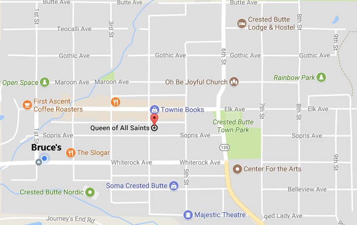
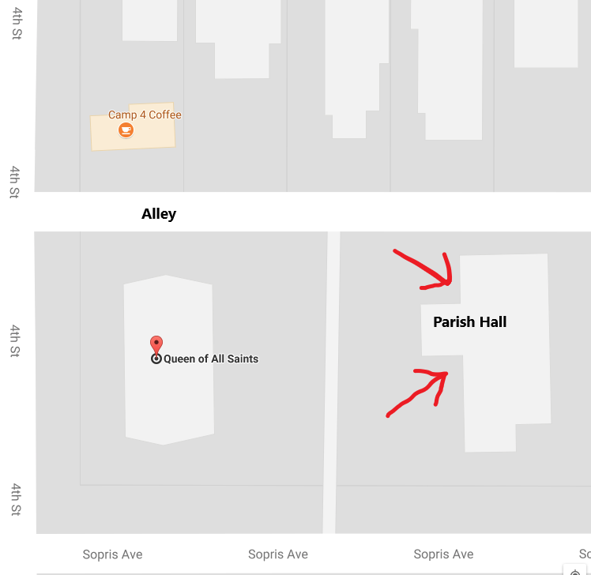

The conference is held at the **Parish Hall** of the Queen of All Saints
Catholic Church, 401 Sopris Ave. The church itself has a dramatic arched copper
roof, and the parish hall is the building behind it, across the parking lot
from the church.

Elk Avenue is our "main street," where you'll find most of the shops and
restaurants.

One way to find it is to find Camp4 Coffee, then go east a block on the alley
next to Camp4:

